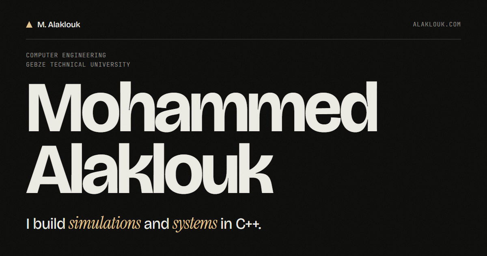

# Personal-site

My personal site. It shows the projects I've built, a bit about me, my education and how to reach me.

**Live:** https://alaklouk.com



## Features

- A hero with my name and a tagline, which fades out as you scroll past it
- A projects section for Scree, Latch and The Deep Ocean, each with a video or screenshot, a feature list, the tech stack and links
- Project videos only play while they're on screen
- A blueprint grid in the background that lights up around the cursor on devices with a mouse
- A marquee of the tools I use that reverses direction when you scroll up
- A degree progress bar that works out how far through my degree I am from the start and end dates
- A live clock in Gebze time, and a button that copies my email
- Entrance animations with GSAP and ScrollTrigger, and smooth scrolling with Lenis
- Reduced-motion support: animations and smooth scrolling turn off, and videos become click to play
- The page still works if JavaScript or the libraries don't load

## Built with

- Plain HTML, CSS and JavaScript, with no framework and no build step
- [GSAP](https://gsap.com/) and ScrollTrigger for the scroll animations
- [Lenis](https://lenis.darkroom.engineering/) for smooth scrolling
- Self-hosted fonts: [Bricolage Grotesque](https://fonts.google.com/specimen/Bricolage+Grotesque), [Instrument Serif](https://fonts.google.com/specimen/Instrument+Serif) and [JetBrains Mono](https://fonts.google.com/specimen/JetBrains+Mono)
- Hosted on [Vercel](https://vercel.com/)

GSAP, ScrollTrigger and Lenis are loaded from a CDN, so you need an internet connection to see the animations, even locally.

## Running it locally

It's a static site, so any static file server works. With Python:

```bash
python -m http.server 5501
```

Then open http://localhost:5501.

## Project structure

| File | What it does |
| --- | --- |
| `index.html` | The whole page: nav, hero, intro, projects, marquee, about, background, contact and footer. Also has the SEO meta tags, Open Graph tags and structured data. |
| `style.css` | All the styling. Design tokens (colours, spacing, type sizes) are at the top in `:root`. Class names follow BEM. |
| `script.js` | Smooth scrolling, the GSAP animations, the background grid, the marquee, the clock, the video playback, the progress bar and the copy button. |
| `assets/fonts/` | The three font files, Latin subset only. |
| `assets/media/` | Project videos, their posters and the Latch screenshot in a few sizes. |
| `assets/` | Favicon, Apple touch icon and the Open Graph image. |
| `CV.pdf` | My CV, linked from the contact section. |
| `robots.txt`, `sitemap.xml` | For search engines. |

## License

[MIT](LICENSE)
